```mermaid
graph TB
    subgraph "Frontend Layer"
        WEB[Web App - React]
        MOBILE[Mobile App]
    end
    
    subgraph "API Gateway Layer"
        GATEWAY[API Gateway :8000]
    end
    
    subgraph "Core Business Services"
        CATALOG[Catalog Service :8001]
        AUTH[Auth Service :8002]
        USERS[Users Service :8003]
        CART[Cart Service :8004]
        ORDERS[Orders Service :8005]
        PAYMENT[Payment Service :8006]
        RECOMMEND[Recommendation Service :8007]
    end
    
    subgraph "Essential Services - HIGH PRIORITY"
        SHIPPING[Shipping Service :8008]
        NOTIFICATIONS[Notification Service :8009]
        ANALYTICS[Analytics Service :8010]
    end
    
    subgraph "Support Services - MEDIUM PRIORITY"
        REVIEWS[Review Service :8011]
        PROMOTIONS[Promotion Service :8012]
        INVENTORY[Inventory Service :8013]
    end
    
    subgraph "Enhancement Services - LOW PRIORITY"
        SEARCH[Search Service :8014]
        MOBILE_SVC[Mobile Service :8015]
        SECURITY[Security Service :8016]
    end
    
    subgraph "Infrastructure"
        POSTGRES[(PostgreSQL :5432)]
        REDIS[(Redis :6379)]
        ELASTIC[(Elasticsearch :9200)]
        RABBITMQ[(RabbitMQ :5672)]
    end
    
    WEB --> GATEWAY
    MOBILE --> GATEWAY
    
    GATEWAY --> CATALOG
    GATEWAY --> AUTH
    GATEWAY --> USERS
    GATEWAY --> CART
    GATEWAY --> ORDERS
    GATEWAY --> PAYMENT
    GATEWAY --> RECOMMEND
    GATEWAY --> SHIPPING
    GATEWAY --> NOTIFICATIONS
    GATEWAY --> ANALYTICS
    GATEWAY --> REVIEWS
    GATEWAY --> PROMOTIONS
    GATEWAY --> INVENTORY
    GATEWAY --> SEARCH
    GATEWAY --> MOBILE_SVC
    GATEWAY --> SECURITY
    
    CATALOG --> POSTGRES
    AUTH --> POSTGRES
    USERS --> POSTGRES
    CART --> REDIS
    ORDERS --> POSTGRES
    PAYMENT --> POSTGRES
    RECOMMEND --> POSTGRES
    SHIPPING --> POSTGRES
    NOTIFICATIONS --> RABBITMQ
    ANALYTICS --> POSTGRES
    REVIEWS --> POSTGRES
    PROMOTIONS --> POSTGRES
    INVENTORY --> POSTGRES
    SEARCH --> ELASTIC
    MOBILE_SVC --> POSTGRES
    SECURITY --> REDIS
```

# 📊 Análise da Estrutura do E-commerce - Serviços Essenciais

## 🎯 **Status Atual da Arquitetura**

### ✅ **Serviços Implementados (7)**

| Serviço | Porta | Status | Funcionalidade |
|---------|-------|--------|----------------|
| **API Gateway** | 8000 | ✅ | Roteamento e orquestração |
| **Catalog Service** | 8001 | ✅ | Gestão de produtos/livros |
| **Auth Service** | 8002 | ✅ | Autenticação e autorização |
| **Users Service** | 8003 | ✅ | Gestão de usuários e perfis |
| **Cart Service** | 8004 | ✅ | Carrinho de compras |
| **Orders Service** | 8005 | ✅ | Gestão de pedidos |
| **Payment Service** | 8006 | ✅ | Pagamentos (placeholder) |
| **Recommendation Service** | 8007 | ✅ | Sistema de recomendações |

### 🏗️ **Infraestrutura de Apoio**

| Componente | Porta | Status | Função |
|------------|-------|--------|--------|
| **PostgreSQL** | 5432 | ✅ | Banco de dados principal |
| **Redis** | 6379 | ✅ | Cache e sessões |
| **Elasticsearch** | 9200 | ✅ | Busca e indexação |

---

## 🚨 **Serviços Essenciais Faltantes**

### 🔥 **Prioridade ALTA - Críticos para Operação**

#### 1. **📦 Shipping Service (Serviço de Envio)**
- **Porta Sugerida:** 8008
- **Funcionalidades:**
  - Cálculo de frete por CEP
  - Integração com transportadoras (Correios, Jadlog, etc.)
  - Rastreamento de envios
  - Gestão de prazos de entrega
  - Cálculo de custos de envio

#### 2. **📧 Notification Service (Serviço de Notificações)**
- **Porta Sugerida:** 8009
- **Funcionalidades:**
  - Notificações por email (SMTP/SendGrid)
  - Notificações por SMS (Twilio)
  - Notificações push (Firebase)
  - Templates de notificação
  - Histórico de notificações

#### 3. **📊 Analytics Service (Serviço de Analytics)**
- **Porta Sugerida:** 8010
- **Funcionalidades:**
  - Métricas de vendas
  - Análise de comportamento do usuário
  - Relatórios de performance
  - Dashboard de métricas
  - Integração com Google Analytics

### 🔶 **Prioridade MÉDIA - Importantes para Experiência**

#### 4. **💬 Review Service (Serviço de Avaliações)**
- **Porta Sugerida:** 8011
- **Funcionalidades:**
  - Avaliações de produtos
  - Sistema de estrelas
  - Comentários e reviews
  - Moderação de conteúdo
  - Agregação de avaliações

#### 5. **🎁 Promotion Service (Serviço de Promoções)**
- **Porta Sugerida:** 8012
- **Funcionalidades:**
  - Cupons de desconto
  - Promoções sazonais
  - Descontos por categoria
  - Campanhas de marketing
  - Gestão de ofertas

#### 6. **📋 Inventory Service (Serviço de Estoque)**
- **Porta Sugerida:** 8013
- **Funcionalidades:**
  - Controle de estoque em tempo real
  - Alertas de estoque baixo
  - Gestão de fornecedores
  - Movimentação de estoque
  - Previsão de demanda

### 🔵 **Prioridade BAIXA - Melhorias e Otimizações**

#### 7. **🔍 Search Service (Serviço de Busca Avançada)**
- **Porta Sugerida:** 8014
- **Funcionalidades:**
  - Busca semântica
  - Filtros avançados
  - Autocomplete
  - Busca por voz
  - Sugestões de busca

#### 8. **📱 Mobile Service (Serviço Mobile)**
- **Porta Sugerida:** 8015
- **Funcionalidades:**
  - API específica para mobile
  - Otimizações para dispositivos móveis
  - Push notifications
  - Geolocalização
  - Offline sync

#### 9. **🛡️ Security Service (Serviço de Segurança)**
- **Porta Sugerida:** 8016
- **Funcionalidades:**
  - Rate limiting
  - Detecção de fraudes
  - Logs de segurança
  - Auditoria de ações
  - Compliance (LGPD)

---

## 🏗️ **Arquitetura Completa Proposta**

---

## 📋 **Plano de Implementação Sugerido**

### **Fase 1: Serviços Críticos (2-3 semanas)**
1. **Shipping Service** - Essencial para completar o fluxo de vendas
2. **Notification Service** - Comunicação com clientes
3. **Analytics Service** - Visibilidade de negócio

### **Fase 2: Serviços de Suporte (2-3 semanas)**
1. **Review Service** - Confiança e social proof
2. **Promotion Service** - Marketing e vendas
3. **Inventory Service** - Controle operacional

### **Fase 3: Serviços de Melhoria (2-4 semanas)**
1. **Search Service** - Experiência de busca
2. **Mobile Service** - Otimização mobile
3. **Security Service** - Segurança e compliance

---

## 🎯 **Benefícios da Implementação Completa**

### **Operacionais**
- ✅ Fluxo completo de vendas (carrinho → pagamento → envio)
- ✅ Comunicação efetiva com clientes
- ✅ Controle total de estoque e operações
- ✅ Visibilidade completa do negócio

### **Experiência do Usuário**
- ✅ Busca avançada e intuitiva
- ✅ Sistema de avaliações confiável
- ✅ Promoções e ofertas atrativas
- ✅ Experiência mobile otimizada

### **Técnicos**
- ✅ Arquitetura escalável e resiliente
- ✅ Monitoramento e observabilidade
- ✅ Segurança robusta
- ✅ Compliance com regulamentações

---

## 💡 **Recomendações Imediatas**

1. **Começar com Shipping Service** - É o mais crítico para completar o e-commerce
2. **Implementar Notification Service** - Essencial para retenção de clientes
3. **Adicionar Analytics Service** - Fundamental para tomada de decisões
4. **Considerar Message Queue** - RabbitMQ ou Apache Kafka para comunicação assíncrona
5. **Implementar Circuit Breaker** - Para resiliência entre serviços

---

*Esta análise identifica os serviços essenciais faltantes para transformar o sistema atual em um e-commerce completo e robusto.*
